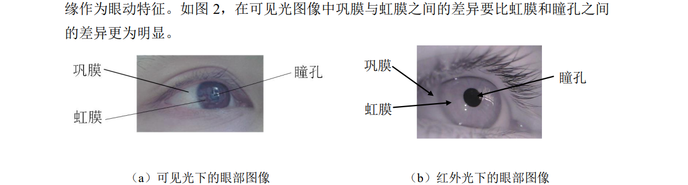
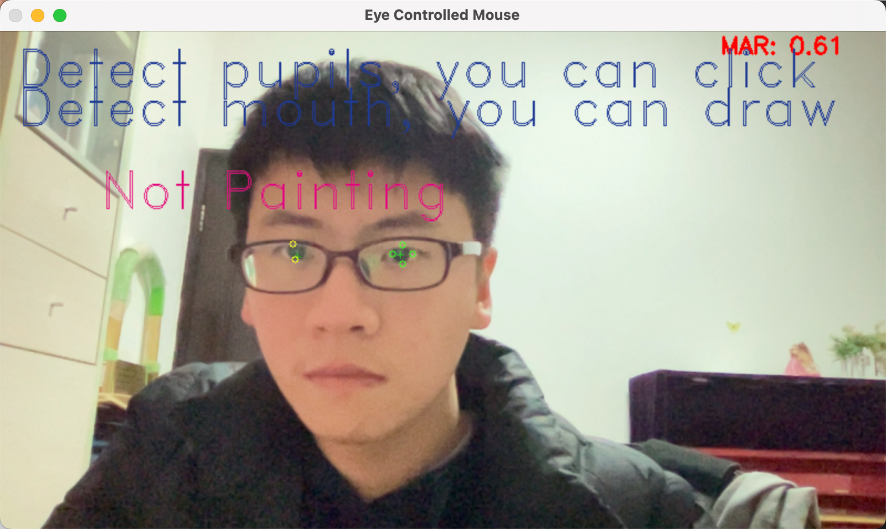
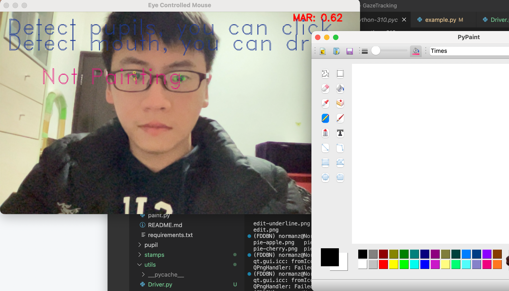
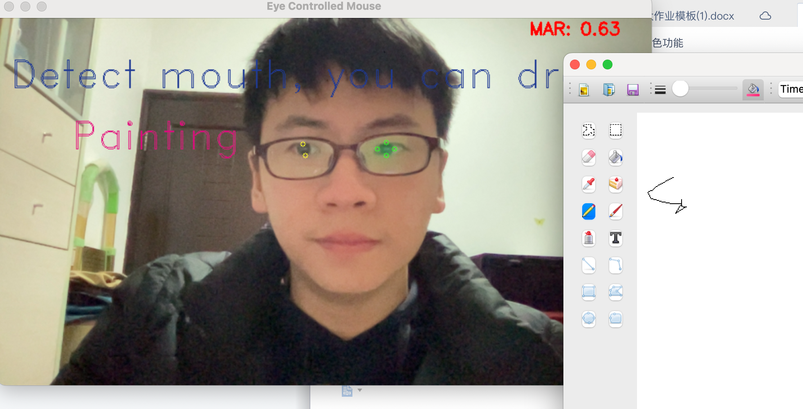

# Eye_Movement_Painter
Real-time Eye-animation system that can paint with eye movement.

The current research on eye movement mainly relies on binocular eye trackers, which include an infrared camera aligned with the pupil used to calculate the line of sight vector and a scene camera used to estimate the observation point of the line of sight in the scene.

However, this is not suitable for the home experimental environment. Therefore, we adopted a monocular line of sight estimation strategy based on facial landmarks and eyes keypoints. After tracking the eye and pupil points with the help of the pre-trained model, the coordinates were enlarged proportionally to the screen to achieve monocular line of sight estimation.

In addition, with a painting program based on PyQT, we are able to 

1. use eye movement to control mouse movement

2. use eye clicks to control mouse click in order to choose painting tools

3. use mouth opening to control the start and end of painting.

